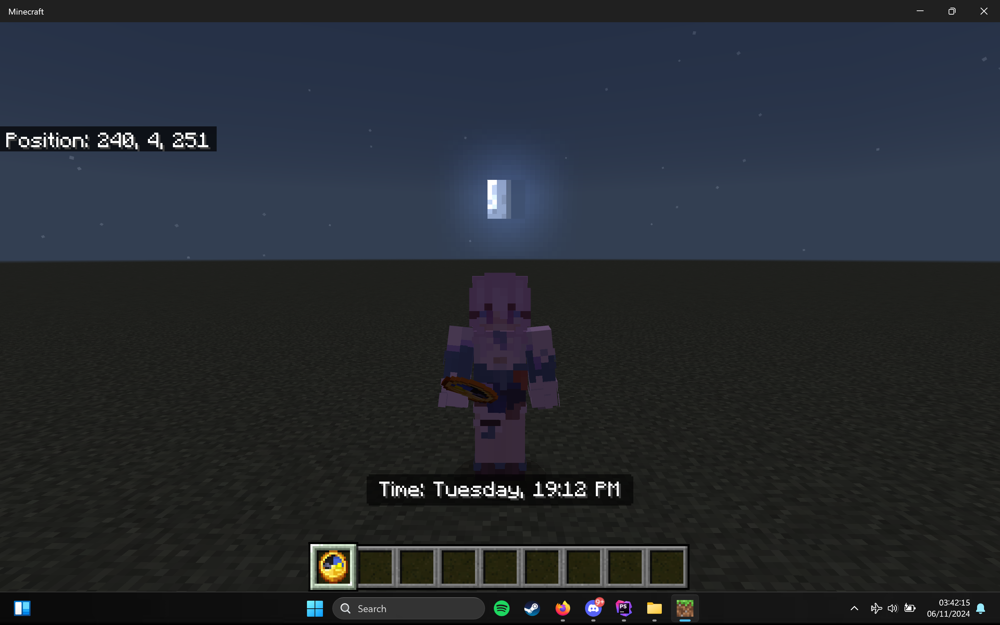
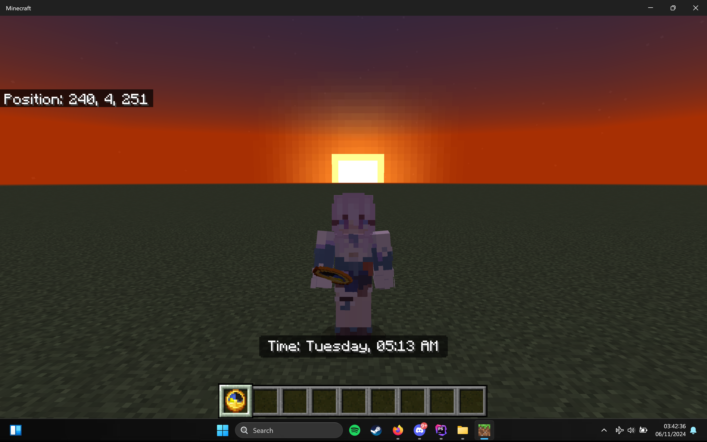

# Description

**Times** plugin that can display the clock on your world minecraft server such as (Sunday, 08:00 AM)
with parameters `(string $day, string $time);`

## Steps To Use
1. **Add clock**: Use `/gamemode c` and take Clock item to Inventory.
2. **Right Click**: Right-click Clock item from your hand inventory
3. **Done**: The digital clock will be displayed in the Tip

# Command & Permission

| Command                     | Description                                                                                                                  | Permission  |
|-----------------------------|------------------------------------------------------------------------------------------------------------------------------|-------------|
| **/times help**             | Showing all commands.                                                                                                        | `times.cmd` |
| **/times days**             | Showing all days.                                                                                                            | `times.cmd` |
| **/times list**             | Showing all times.                                                                                                           | `times.cmd` |
| **/times set [time] [day]** | Set the time and day on the world.                                                                                                                        | `times.cmd` |

# Issues

If you have any issues, please report them [here](https://github.com/pixelwhiz/Times/issues/new).

# Preview

